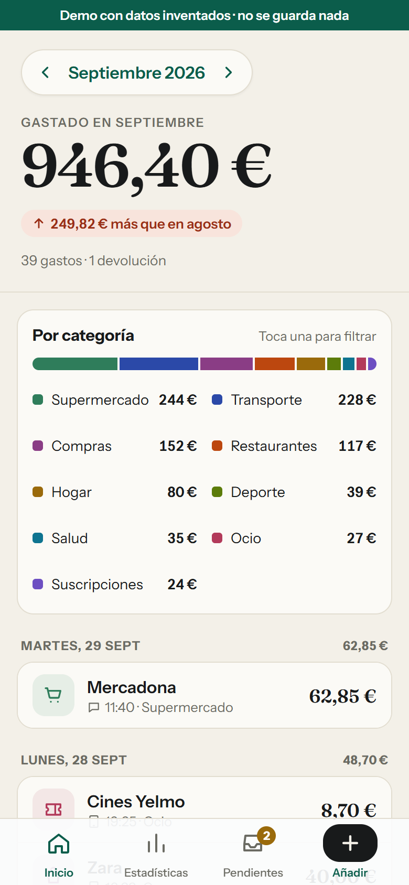
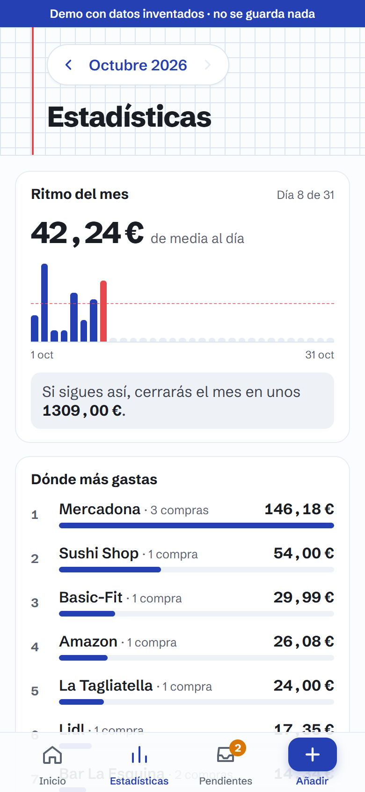
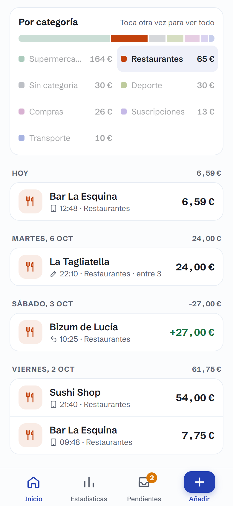
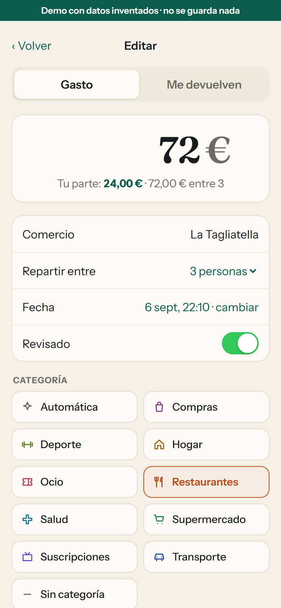
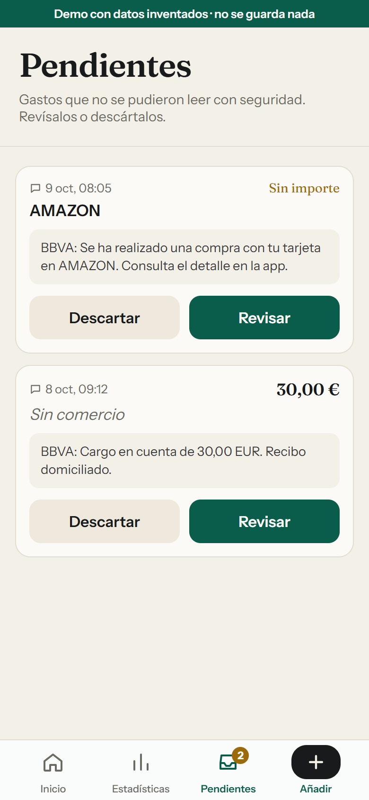
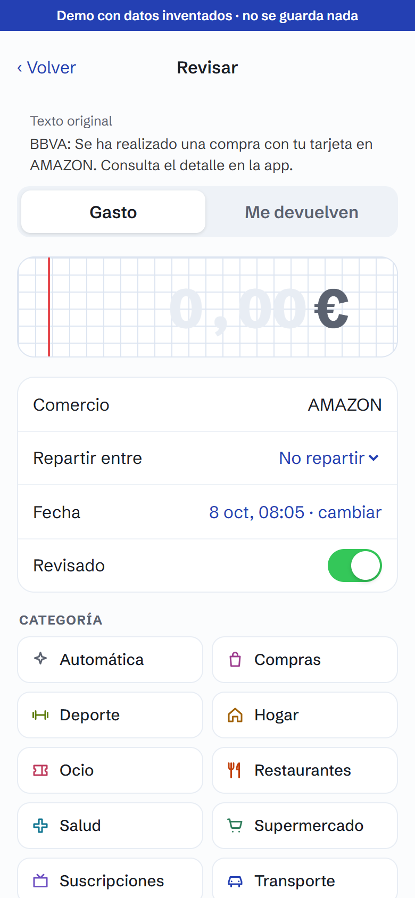
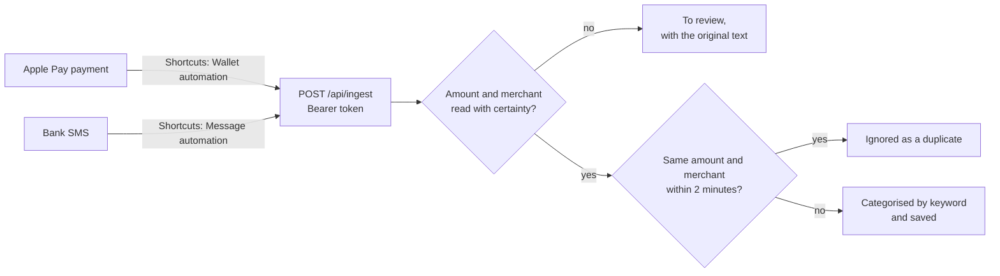

# Cuadra

**A personal expense tracker that mostly fills itself in. Apple Pay payments and bank text messages are logged automatically, so I only type what the bank can't know: splitting a bill and money paid back to me.**

**[Try the live demo →](https://cuadra-phi-green.vercel.app/demo)** No account needed. It runs on invented data and nothing you tap is saved. The interface is in Spanish.

<table>
  <tr>
    <td></td>
    <td></td>
    <td></td>
  </tr>
  <tr>
    <td></td>
    <td></td>
    <td></td>
  </tr>
</table>

## The problem

An expense tracker is only as good as the data in it, and typing every purchase by hand is the habit that never sticks. So Cuadra logs Apple Pay payments and bank text messages on its own.

The other thing a bank statement gets wrong is what I actually spent. If I pay a 60 € dinner for three, the bank says 60 €, but my share is 20 €. That part is still manual: I open the expense, split it between three, and only my share counts. Money paid back to me, like a Bizum or settling a Tricount, I log as a refund, and it subtracts from the month.

## What it does

| Screen | What it answers |
| --- | --- |
| **Inicio** (Home) | How much have I spent this month, and is it more or less than last month? A stacked bar splits it by category (tap one to filter the list), and below it every movement, grouped by day with daily subtotals. Swipe a row to delete it. |
| **Estadísticas** (Stats) | Am I on pace? The average per day, a bar for every day of the month against that average, and a month-end forecast at the current pace. Plus where the money goes by merchant, and how each category moved against last month. |
| **Pendientes** (To review) | Bank messages the parser couldn't read with certainty, shown with their original text so I can complete or discard them. |
| **Añadir** (Add) | Manual entry for anything that isn't captured, or money paid back to me. Any expense, including one captured automatically, can be opened and split equally between people, and then only my share is stored. |

In the background:

- **Apple Pay:** an iOS Shortcuts automation sends each Wallet payment to the app as it happens.
- **Bank SMS:** another automation forwards bank text messages, and the server extracts the amount and the merchant.
- **A one-tap shortcut** covers purchases neither automation catches: it asks for the amount and the merchant, and sends them the same way.
- **Categories** are assigned from merchant keywords. Correct one and tick *Remember*, and every past expense from that merchant follows.

## How capture works

Examples from the parser's test suite (made-up messages):

| Message | Result |
| --- | --- |
| `BBVA: Compra con tu tarjeta ****1234 en MERCADONA VALENCIA por 23,45 EUR. Saldo disponible: 1.234,56 EUR` | 23.45 € at MERCADONA VALENCIA. The balance is ignored. |
| `ING: Has pagado 8,90 € en SPOTIFY con tu tarjeta terminada en 1111` | 8.90 € at SPOTIFY |
| `BBVA: El código para confirmar tu compra de 59,99 EUR en ZALANDO es 482913…` | Not an expense: it's a verification code |
| `Compra 20,00 EUR y 35,50 EUR en PARKING CENTRO` | Two amounts: ambiguous, sent to review |
| `Compra de 15.99 USD en APPLE.COM/BILL` | Foreign currency: not assumed to be euros, sent to review |

## Product decisions

- **Never guess with money.** The parser keeps only what it's sure of. Two amounts, a foreign currency or a missing merchant send the message to *To review* with its original text. An amount like `1,234` is rejected as ambiguous instead of being read as either one thousand or one euro.
- **What I really spent, not what left my account.** A refund (a Bizum for my share of a dinner, settling a Tricount) is its own type of movement, logged by hand, and subtracts from the month and from its category. Splitting a bill stores my share and keeps a note of the total, so it can be edited later without dividing twice.
- **Learn from corrections.** Fixing a category once is enough: the merchant's keyword moves to that category, and past expenses move with it. When several keywords match, the longest and most specific one wins.
- **Capture has to survive the iPhone.** Shortcuts capitalises field names, autocorrect slips in spaces, and pasted tokens bring invisible characters. The endpoint normalises all of that, and when it rejects a request it says why without revealing the expected token.
- **Built for one person.** There is no sign-up: one owner account, sign-ups disabled in Supabase, and row-level security on every table.
- **Feel like an app.** It's installed from Safari to the home screen and opens full screen. The service worker only shows an offline page and deliberately caches no financial data.

## How I built it

I defined the product and directed the work: what to build and why, the specs and the trade-offs, and the review of every change. **The code was written with [Claude Code](https://claude.com/claude-code), Anthropic's AI coding agent**, which is why every commit is co-authored. The process is in the repo:

- **Specs before code.** Refunds and the stats redesign each have a design doc and an implementation plan in [`docs/superpowers/`](docs/superpowers/).
- **Small, reviewable steps.** The history is a sequence of focused commits, each checked by type-checking and the unit tests (`npm test`).
- **Real problems in production.** Three examples:
  - *Signing in from the installed app.* Email magic links open in Safari, which doesn't share its session with a home-screen web app. Login moved to a 6-digit code typed inside the app, which in turn needed my own SMTP sender to edit the email and get past the default limit of a few emails an hour.
  - *Shortcuts got a 401 before reaching the app.* Vercel's own deployment protection was blocking them. It's off for production, since the endpoint has its own token check.
  - *Requests rejected for invisible reasons.* Field names arrived as `Wallet` or `source ` and tokens with hidden characters from copy and paste. The fix was the tolerant endpoint described above, with error messages that say exactly what to change.

## Tech

Next.js 16 (App Router, Server Actions) · React 19 · TypeScript · Supabase (Postgres with row-level security, email one-time codes) · iOS Shortcuts · Vercel. Plain CSS, no UI library, five runtime dependencies.

- **Screens are pure views.** The real app feeds them from Supabase and the [demo](https://cuadra-phi-green.vercel.app/demo) feeds them invented data, so the two can't drift apart. Demo pages never import the database client, and in the demo every save and delete stops in the browser.
- **Logic lives in small pure modules** (SMS parsing, amounts, dates, categorisation, learning rules, stats, demo data), unit-tested with Node's built-in test runner and no database.
- **The ingest endpoint** compares the token in constant time and is the only code that uses the server-side admin client, always on behalf of the single owner.
- **Dates are Europe/Madrid**, wherever the server runs.

Developer notes (in Spanish): [`docs/desarrollo.md`](docs/desarrollo.md). Setting it up from scratch, Shortcuts included: [`SETUP.md`](SETUP.md).

## Privacy

No financial data, keys or tokens live in this repository: the only data in it is the made-up test messages and the demo's invented movements. Real movements are stored in my own Supabase project behind row-level security.
